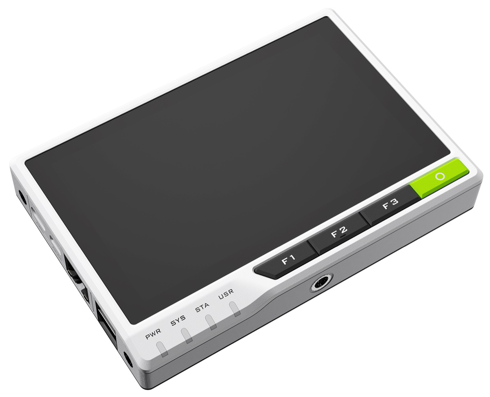

# Chromasurf — reTerminal CM4



<sub>Image: © [Seeed Studio](https://wiki.seeedstudio.com/reTerminal/)</sub>

**Chromasurf** is an industrial IoT platform built on [Elixir](https://elixir-lang.org) and [Nerves](https://nerves-project.org), developed by [Formrausch](https://formrausch.com). It provides the firmware foundation for connected HMI terminals, gateways, and sensor nodes — with automatic network clustering, over-the-air updates, real-time messaging, and full hardware abstraction built in. Designed for production use in manufacturing, process control, and industrial automation.

This repository contains the Nerves base system image for the [Seeed Studio reTerminal](https://wiki.seeedstudio.com/reTerminal/) (CM4, aarch64). It includes the Linux kernel, bootloader, DSI display and touch drivers, and all hardware support needed to run Chromasurf applications on this device. Built on `nerves_system_br` (Buildroot) with WPE WebKit/Cog browser and GPU acceleration (Mesa V3D).

## Using

Add the system as a dependency in your Nerves app and set `MIX_TARGET=reterminal_cm4`:

```elixir
# mix.exs
{:reterminal_cm4, github: "chromasurf/reterminal_cm4", runtime: false, targets: :reterminal_cm4}
```

```bash
export MIX_TARGET=reterminal_cm4
mix deps.get
mix firmware
mix burn
```

The system ships Erlang/OTP 29 — your application needs Elixir ≥ 1.20. When using NervesKey/ATECC608A, depend on `nerves_key_pkcs11 ~> 1.3`.

## Hardware Overview

| Peripheral | Chip | Bus | Address | sysfs / Device |
|---|---|---|---|---|
| DSI display | ILI9881c | MIPI DSI | — | 720x1280, rotate=270 |
| Touchscreen | STM32 MCU bridge | I2C | — | `/dev/input/event*` (seeed-tp) |
| Light sensor | LTR-303ALS | I2C1 | 0x29 | `/sys/bus/iio/devices/iio:device0/` |
| Accelerometer | LIS3DHTR | I2C1 | 0x19 | IIO device |
| RTC | PCF8563W | I2C3 | 0x51 | `/dev/rtc0` |
| Crypto | ATECC608A | I2C3 | 0x60 | via NervesKey library |
| GPIO expander | PCA9554 | I2C1 | 0x38 | User buttons, LEDs, buzzer |
| Backlight | — | I2C1 | 0x45 | `/sys/class/backlight/1-0045/` |
| Battery charger | BQ24179 | I2C1 | 0x6b | (via bridge overlay) |
| TPM 2.0 | SLB9670 | SPI0 | CE1 | `/dev/tpm0` |

## Sensors

### Light Sensor (LTR-303ALS)

```elixir
# Read ambient light in lux
{lux, _} =
  File.read!("/sys/bus/iio/devices/iio:device0/in_illuminance_input")
  |> String.trim()
  |> Integer.parse()
```

### Accelerometer (LIS3DHTR)

Available as an IIO device on I2C1 at address 0x19. Use the `circuits_i2c` or IIO sysfs interface to read acceleration values.

### CPU Temperature

```elixir
{temp, _} = File.read!("/sys/class/thermal/thermal_zone0/temp") |> Integer.parse()
temp_c = temp / 1000
```

## User Interface

### LEDs

Three user LEDs controlled via sysfs:

```elixir
# Turn on LED 0
File.write("/sys/class/leds/usr_led0/brightness", "1")

# Turn off
File.write("/sys/class/leds/usr_led0/brightness", "0")

# Available: usr_led0, usr_led1, usr_led2
```

Or use the [Delux](https://hex.pm/packages/delux) library for effects:

```elixir
Delux.render(Delux.Effects.blink(:red, 2))
Delux.render(Delux.Effects.off())
```

### Buzzer

```elixir
# Beep for 100ms
File.write("/sys/class/leds/usr-buzzer/brightness", "1")
:timer.sleep(100)
File.write("/sys/class/leds/usr-buzzer/brightness", "0")
```

### Buttons

Four user buttons (btn0–btn3) via PCA9554 GPIO expander, exposed as keyboard events. Power button on GPIO 13.

## Display

### DSI Configuration

The 720x1280 DSI display is configured with 270 degree rotation. Kernel cmdline includes `video=DSI-1:720x1280@60,rotate=270`. HDMI output is disabled by default.

### Backlight

```elixir
# Set brightness (0–255)
File.write("/sys/class/backlight/1-0045/brightness", "128")

# Read current brightness
File.read!("/sys/class/backlight/1-0045/brightness")
```

### Kiosk Mode (Weston + Cog)

The system includes Weston compositor and Cog WebKit browser for kiosk applications. See `examples/kiosk.ex` for a full supervisor setup. Quick start:

```elixir
# Start Weston
:os.cmd(~c"seatd &")
:os.cmd(~c"XDG_RUNTIME_DIR=/run weston -B drm &")

# Open a URL in fullscreen
:os.cmd(~c"XDG_RUNTIME_DIR=/run WAYLAND_DISPLAY=wayland-1 cog http://localhost:4000")
```

Remote WebKit Inspector is available on port 9222 when `WEBKIT_INSPECTOR_HTTP_SERVER=0.0.0.0:9222` is set.

### Rendering Performance

The system ships with three performance defaults; apps do not need to configure anything:

- **GPU painting**: `/etc/erlinit.config` sets `WEBKIT_SKIA_GPU_PAINTING_THREADS=4`, so
  WPE WebKit's Skia rasterizes on the v3d GPU instead of the CPU — roughly twice the
  frame rate when scrolling image-heavy pages. Override per launch via the `env:`
  option of the process that starts Cog.
- **CPU governor**: the kernel defaults to `performance`; `schedutil` costs frame
  deadlines under scroll load.
- **Transparent Hugepages**: enabled, which lets the v3d driver use Super Pages.

Known limitation: content with `box-shadow` on scrolling surfaces stalls WPE 2.50's
rendering pipeline regardless of these settings — avoid soft shadows in kiosk UIs.

## Security

### ATECC608A

Microchip crypto co-processor at I2C3 address 0x60. Use [NervesKey](https://hex.pm/packages/nerves_key) for provisioning and certificate management:

```elixir
{:ok, i2c} = ATECC508A.Transport.I2C.init([])
info = NervesKey.default_info(i2c)
serial = info.manufacturer_sn
```

Note: The ATECC608A is in sleep mode by default and won't appear in `i2cdetect` without a wake sequence.

### TPM 2.0

Infineon SLB9670 on SPI0. Available at `/dev/tpm0`. The system includes `tpm2-pkcs11` for PKCS#11 integration.

## RTC

NXP PCF8563W at I2C3 address 0x51. Available as `/dev/rtc0`:

```elixir
# Read hardware clock
:os.cmd(~c"hwclock -r")

# Set system time from RTC
:os.cmd(~c"hwclock -s")
```

## Camera

Supports official Raspberry Pi camera modules via [`libcamera`](https://libcamera.org/):

```elixir
cmd("libcamera-jpeg -n -v -o /data/test.jpeg")
```

## Audio

Audio output via WM8960 codec (bridge overlay) or HDMI. Linux ALSA drivers:

```elixir
# Force HDMI output
cmd("amixer cset numid=3 2")

# Force analog jack output
cmd("amixer cset numid=3 1")
```

## Supported WiFi Devices

The onboard Raspberry Pi CM4 WiFi module (`brcmfmac` driver) is included but **disabled by default** via `dtoverlay=disable-wifi` and `dtoverlay=disable-bt` in `config.txt`. Remove these overlays to re-enable.

## Provisioning

Key-value store outside any filesystem for device identity:

```elixir
# Set serial number (persists across firmware updates)
cmd("fw_setenv nerves_serial_number 12345678")

# Or at burn time:
# NERVES_SERIAL_NUMBER=12345678 fwup firmware.fw
```

## Building the System

Prebuilt artifacts are published as GitHub releases. To build from source:

```bash
mix deps.get
mix compile
mix nerves.artifact
```

WebKit compilation is slow and memory-hungry. If the build gets OOM-killed, simply run `mix compile` again — Buildroot resumes where it left off.

## Linux Kernel

Kernel: Linux 6.18 (Raspberry Pi fork, tag `stable_20260527`)
Config: `linux-6.18.defconfig` (stripped-down for Nerves)
Custom patches: `linux/ili9881c_fix.patch` (DSI display driver fix)

---

 [formrausch](https://formrausch.com) /ˈfɔʁmˌʁaʊ̯ʃ/ is a creative studio uniting designers and developers to build beautiful, functional digital products.

## License

Apache-2.0
